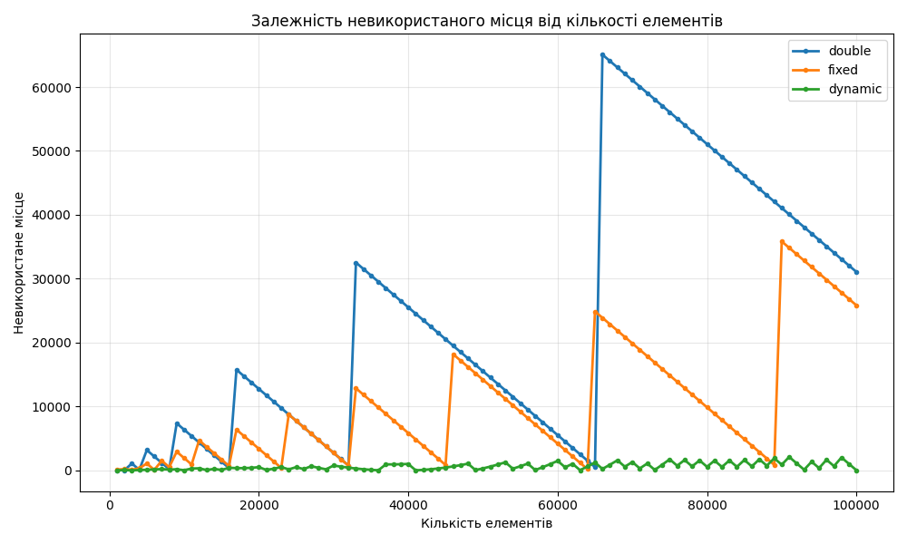
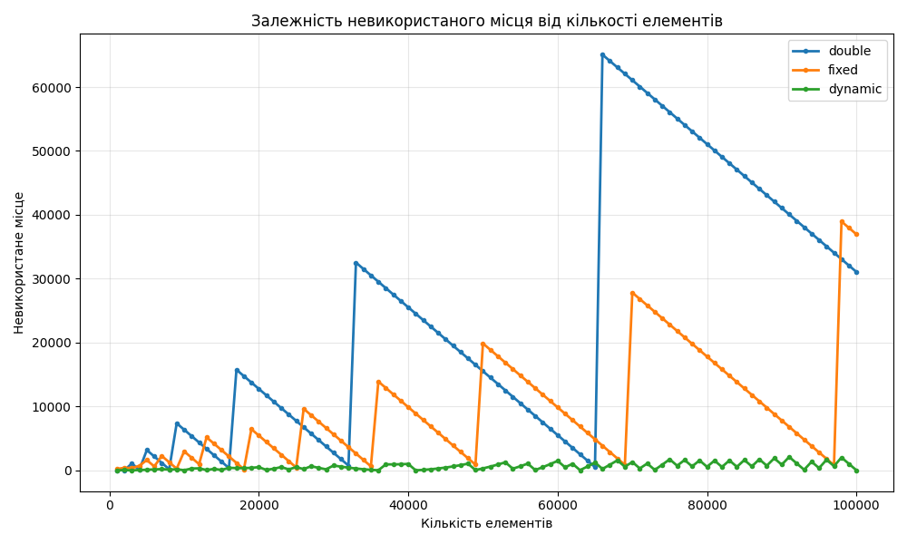
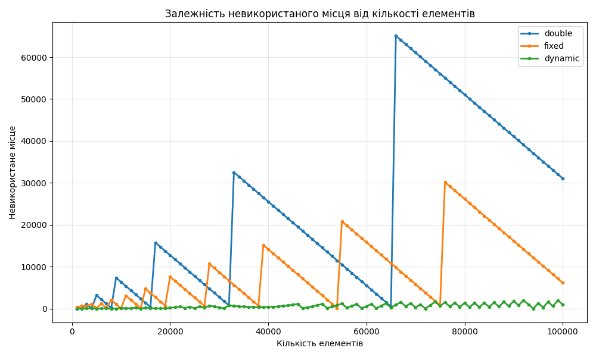

# Динамічний масив на Python: реалізація та аналіз

В рамках роботи був реалізований клас DynamicArray, який використовує модуль ctypes для створення та розширення масиву фіксованого розміру. Масив дозволяє додавати елементи, автоматично збільшуючи ємність при потребі.
Передбачено три стратегії зростання capacity:

Double: при кожному перевиділенні нова ємкість = стара * 2

Fixed: коефіцієнт = 1 + (4 / 10)

Dynamic: коефіцієнт = 1 + (4 / 10) / log2(size + 2)

Клас підтримує ручний доступ до елементів (методи get/set), ітерацію через print_all та конвертацію в список.
Висновки щодо ефективності стратегій
Double-стратегія дає меншу кількість перевиділень і більшу невикористану пам’ять, але найшвидша.

Fixed коефіцієнт зменшує втрати пам’яті, але призводить до більшої кількості resize-операцій.

Dynamic стратегія найбільш економна по пам’яті, але повільніша через часті resize.

Додавання елементів масштабується добре при великих стартових capacity та агресивному growth factor, але це шкодить ефективності використання пам’яті.

# Графіки для порівняння різних стратегій зростання

### Capacity = 8

### Середнє невикористане місце:
| Стратегія | Resize операцій | Невикористане місце (елементів) |
| --------- | --------------- | ------------------------------- |
| double    | 14              | 31072                           |
| fixed     | 29              | 25841                           |
| dynamic   | 246             | 37                              |

### Capacity = 32

### Середнє невикористане місце:
| Стратегія | Resize операцій | Невикористане місце (елементів) |
| --------- | --------------- | ------------------------------- |
| double    | 12              | 31072                           |
| fixed     | 25              | 36962                           |
| dynamic   | 226             | 37                              |

### Capacity = 128

### Середнє невикористане місце:
| Стратегія | Resize операцій | Невикористане місце (елементів) |
| --------- | --------------- | ------------------------------- |
| double    | 10              | 31072                           |
| fixed     | 20              | 6173                            |
| dynamic   | 202             | 1000                            |

## Порівняння результатів

| Capacity | Стратегія | Середнє невикористане місце (елементів) | Resize операцій |
| -------- | --------- | --------------------------------------- | --------------- |
| 8        | double    | 23996.00                                | 14              |
| 8        | fixed     | 10155.72                                | 29              |
| 8        | dynamic   | 654.66                                  | 246             |
| 32       | double    | 23996.00                                | 12              |
| 32       | fixed     | 9323.05                                 | 25              |
| 32       | dynamic   | 654.66                                  | 226             |
| 128      | double    | 23996.00                                | 10              |
| 128      | fixed     | 9280.11                                 | 20              |
| 128      | dynamic   | 609.46                                  | 202             |

### Основні спостереження
Аналіз показує, що double-стратегія забезпечує найменшу кількість resize-операцій (10–14), але найбільше невикористаного місця (близько 24k елементів), незалежно від початкової ємності. Fixed-стратегія балансує: помірна кількість resize (20–29) і менші втрати пам'яті (9–10k елементів). Dynamic-стратегія найекономніша по пам'яті (609–655 елементів), але значно повільніша через часті resize (202–246). Зростання початкової ємності зменшує resize для всіх стратегій, але double лишається найшвидшою, а dynamic — найпам'яттєво-ефективнішою.
​
